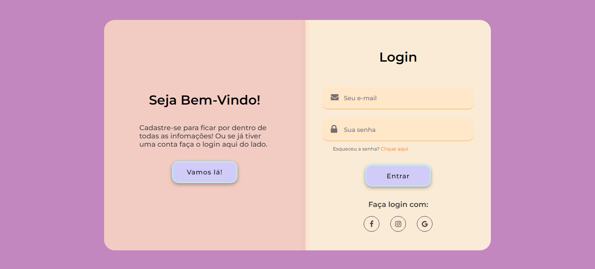

<h1 align="center"> Projeto tela de login e cadastro </h1>

Esse projeto é um teste que fiz para melhorar meus conhecimentos em HTML e CSS.  

 

  

## 🚀 Tecnologias

Esse projeto foi desenvolvido com as seguintes tecnologias:

- HTML e CSS

## 💻 Projeto

A tela de login e cadastro foi um desafio que fiz para mim mesma, queria ver até onde conseguia ir, fiquei impressionada por ter coneguido terminar e ter ficado do jeito que eu quis, a expeiência foi maravilhosa!

Fiz eles responsivos usando o media queries e fiz alguns botões e links funcionarem para mudar de uma página para outra.

- [Visite o projeto online]("https://lillip3.github.io/Landing-Page")

## :memo: Licença

Feito com ♥ by Lillian Paula :wave:
